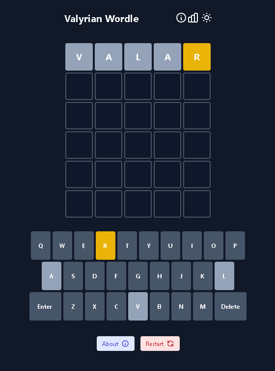

# Valyrian Wordle

Valyrian Wordle is a re-implementation of the modern classic [Wordle game](https://www.powerlanguage.co.uk/wordle/) into the constructed language of High Valyrian, constructed by David J. Peterson for George RR Martin's A Song of Ice of Fire and HBO's Game of Thrones. The game is available to play, for free, in your browser at: https://swilliamsio.itch.io/valyrian-wordle.

<p align="center">
  
</p>

This project was originally forked from [Latin-Wordle](https://github.com/theotarr/latin-wordle) under MIT license. Many thanks to [LatinDictionary.io](https://wordle.latindictionary.io/) for that! This repo is under the same license.

### Contributing
If you would like to contribute to the project, please either create your own branch and submit a pull request or create a GitHub issue. Feel free to contribute by submitting missing or purging difficult words from the word lists where appropriate!

### To Run Locally
Clone the repository and perform the following command line actions:

```bash
$ cd valyrian-wordle
$ npm install
$ npm run start
```
